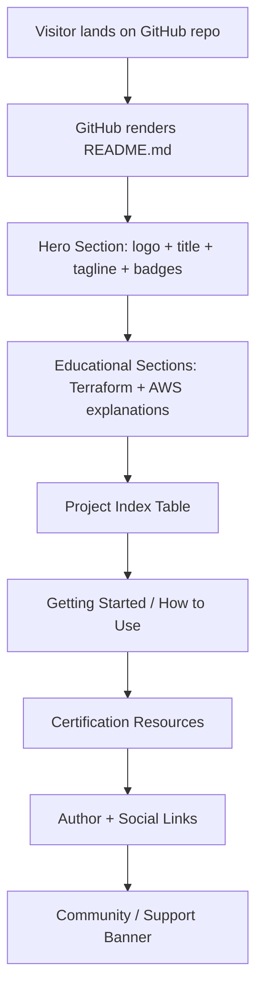

# Design Document: Professional README

## Overview

This design describes the structure, content, and layout of a professional `README.md` for the `AWS_Terraform_Projects` GitHub repository. The README serves as the repository's landing page — targeting students, job seekers, and developers learning Terraform and AWS through daily hands-on projects.

The output is a single `README.md` file at the repository root. It must be visually rich (badges, images, tables), SEO-friendly (keyword-dense headings and alt text), and immediately useful (clone commands, project index, certification links).

The design is organized around the 12 requirements in `requirements.md`. Each section below maps directly to one or more requirements and specifies the exact content, markup, and asset references needed to produce the final file.

---

## Architecture

The README is a static Markdown document rendered by GitHub's Markdown engine. There is no build step, no templating engine, and no dynamic content. The architecture is:

```
Repository root
├── README.md          ← the artifact produced by this spec
├── Images/
│   ├── logo.jpeg      ← hero banner
│   ├── devops.png     ← community/support banner
│   └── terraform_archi.webp  ← Terraform architecture diagram
├── Day2_VPC_Networking/
└── Day3_Variables-Validation_locals/
```

GitHub renders `README.md` automatically. All image paths are relative to the repository root. All badge URLs are absolute shields.io URLs. HTML `<div align="center">` blocks are used for centering because GitHub's Markdown renderer does not support CSS.



---

## Components and Interfaces

The README is composed of 10 discrete sections. Each section is self-contained and maps to one or more requirements.

### Section 1 — Hero (Req 1, 2)

**Purpose:** Immediate visual impact and technology identification.

**Layout:**
```
<div align="center">
  
  <h1>AWS Terraform Projects</h1>
  <p>Daily hands-on Terraform + AWS projects — from zero to certified, one day at a time.</p>
  [badge row]
</div>
```

**Badge row** (all shields.io, rendered inline):

| Badge | shields.io URL |
|---|---|
| Terraform | `https://img.shields.io/badge/Terraform-7B42BC?style=for-the-badge&logo=terraform&logoColor=white` |
| AWS | `https://img.shields.io/badge/AWS-FF9900?style=for-the-badge&logo=amazonaws&logoColor=white` |
| HashiCorp | `https://img.shields.io/badge/HashiCorp-000000?style=for-the-badge&logo=hashicorp&logoColor=white` |
| License: MIT | `https://img.shields.io/badge/License-MIT-yellow.svg?style=for-the-badge` |
| Stars | `https://img.shields.io/github/stars/upasanatailor/AWS_Terraform_Projects?style=for-the-badge&color=gold` |
| Forks | `https://img.shields.io/github/forks/upasanatailor/AWS_Terraform_Projects?style=for-the-badge&color=blue` |
| Last Commit | `https://img.shields.io/github/last-commit/upasanatailor/AWS_Terraform_Projects?style=for-the-badge&color=green` |

All badges link to the repository: `https://github.com/upasanatailor/AWS_Terraform_Projects`

---

### Section 2 — What is Terraform? (Req 3)

**Purpose:** Onboard visitors unfamiliar with Terraform.

**Content outline:**
- H2 heading: `## 🔧 What is Terraform?`
- 2–3 sentence explanation: open-source IaC tool by HashiCorp, declarative HCL syntax, multi-cloud support
- Core workflow callout: **Write → Plan → Apply**
- Centered architecture image: `Images/terraform_archi.webp`, alt text `"Terraform architecture diagram showing Write, Plan, Apply workflow"`
- Bullet list of key Terraform concepts: providers, resources, state, modules

---

### Section 3 — What is AWS? (Req 4)

**Purpose:** Onboard visitors unfamiliar with AWS.

**Content outline:**
- H2 heading: `## ☁️ What is AWS?`
- 2–3 sentence explanation: Amazon Web Services, largest cloud provider, on-demand infrastructure
- Bullet list of service categories used in this repo: Compute (EC2), Networking (VPC, Subnets, Route Tables, IGW), Storage (S3), Security (IAM, Security Groups)

---

### Section 4 — About This Repository (Req 5)

**Purpose:** Explain the learning structure and outcomes.

**Content outline:**
- H2 heading: `## 📚 About This Repository`
- Purpose statement: structured daily projects, each in its own `DayN_<Topic>/` folder
- Learning outcomes bullet list:
  - Terraform proficiency (HCL, state management, modules)
  - AWS service knowledge (VPC, EC2, S3, IAM, and more)
  - DevOps practices (IaC, automation, version control)
  - Certification readiness (HashiCorp Terraform Associate, AWS Solutions Architect)

---

### Section 5 — Daily Projects Table (Req 6)

**Purpose:** Navigable index of all day folders.

**Layout:**

```markdown
## 📅 Daily Projects

| Day | Topic | Key Concepts | Folder |
|-----|-------|-------------|--------|
| Day 2 | VPC Networking | VPC, Subnets, Route Tables, Internet Gateway, EC2, Security Groups | [Day2_VPC_Networking](./Day2_VPC_Networking/) |
| Day 3 | Variables, Validation & Locals | Input variables, validation rules, local values, tfvars | [Day3_Variables-Validation_locals](./Day3_Variables-Validation_locals/) |
```

**Maintenance note** (rendered in README):
> 📝 **Contributors:** When adding a new `DayN_<Topic>/` folder, please update this table with the day number, topic, key concepts, and a link to the folder.

---

### Section 6 — Getting Started (Req 7)

**Purpose:** Enable visitors to clone and run projects immediately.

**Content outline:**
- H2 heading: `## 🚀 Getting Started`
- Prerequisites subsection (H3): Terraform CLI ≥ 1.0, AWS CLI v2, AWS account with credentials configured (`aws configure`)
- Steps:
  1. Fork the repository (link to GitHub fork UI)
  2. `git clone https://github.com/upasanatailor/AWS_Terraform_Projects`
  3. `cd` into a day folder, e.g. `cd Day2_VPC_Networking`
  4. `terraform init`
  5. `terraform plan`
  6. `terraform apply`
- Note about forking for personal use

All commands rendered in fenced code blocks with `bash` syntax highlighting.

---

### Section 7 — Certification Resources (Req 8)

**Purpose:** Connect repo content to certification exam preparation.

**Content outline:**
- H2 heading: `## 🎓 Certification Resources`
- HashiCorp Terraform Associate subsection: link to `https://developer.hashicorp.com/certifications/infrastructure-automation`, note that all projects use exam-relevant HCL patterns
- AWS certifications subsection: AWS Solutions Architect Associate, AWS DevOps Engineer Professional — links to `https://aws.amazon.com/certification/`
- Mapping note: each day folder covers topics that appear in both Terraform Associate and AWS exam domains

---

### Section 8 — Author & Connect (Req 9)

**Purpose:** Surface the author's identity and social profiles.

**Content outline:**
- H2 heading: `## 👩‍💻 About the Author`
- Author name: **Upasana Tailor**
- Brief bio: Cloud & DevOps practitioner, educator, content creator
- Social badges (shields.io, centered row):

| Platform | Badge URL | Link |
|---|---|---|
| LinkedIn | `https://img.shields.io/badge/LinkedIn-0077B5?style=for-the-badge&logo=linkedin&logoColor=white` | `https://www.linkedin.com/in/upasana-tailor-b24539152/` |
| GitHub | `https://img.shields.io/badge/GitHub-181717?style=for-the-badge&logo=github&logoColor=white` | `https://github.com/upasanatailor` |
| YouTube | `https://img.shields.io/badge/YouTube-FF0000?style=for-the-badge&logo=youtube&logoColor=white` | `https://www.youtube.com/@CloudKaro` |

---

### Section 9 — Community & Support (Req 10)

**Purpose:** Encourage engagement and drive YouTube traffic.

**Content outline:**
- H2 heading: `## 🌟 Support & Community`
- Centered `Images/devops.png` banner, alt text `"DevOps community banner"`
- Call-to-action text: "If this repo helps you, please ⭐ star it, 🍴 fork it, and share it with your network."
- YouTube CTA: "Watch the full video series on [CloudKaro YouTube](https://www.youtube.com/@CloudKaro) for step-by-step walkthroughs."

---

### Section 10 — Fork & Contribute (Req 12)

**Purpose:** Guide contributors and clarify licensing.

**Content outline:**
- H2 heading: `## 🤝 Contributing`
- Fork instructions: click Fork on GitHub, clone your fork, create a branch, add a new `DayN_<Topic>/` folder, open a pull request
- Contribution guidelines: follow existing folder naming convention, include a `README.md` in the new folder, update the Daily Projects table
- License note: "This repository is licensed under the [MIT License](./LICENSE). You are free to use, modify, and distribute the content with attribution."

---

## Data Models

The README has no runtime data model — it is a static document. However, the following logical structures govern its content:

### Day Entry (Project Index Row)

Each row in the Daily Projects table represents one `DayN_<Topic>/` folder:

```
DayEntry {
  day:          string   // e.g. "Day 2"
  topic:        string   // e.g. "VPC Networking"
  keyConcepts:  string   // comma-separated concepts
  folderPath:   string   // relative path, e.g. "./Day2_VPC_Networking/"
}
```

Current entries:

```
DayEntry { day: "Day 2", topic: "VPC Networking",
  keyConcepts: "VPC, Subnets, Route Tables, Internet Gateway, EC2, Security Groups",
  folderPath: "./Day2_VPC_Networking/" }

DayEntry { day: "Day 3", topic: "Variables, Validation & Locals",
  keyConcepts: "Input variables, validation rules, local values, tfvars",
  folderPath: "./Day3_Variables-Validation_locals/" }
```

### Badge

Each badge is a shields.io image-link pair:

```
Badge {
  label:    string   // display label
  imageUrl: string   // shields.io absolute URL
  linkUrl:  string   // destination URL
  altText:  string   // accessibility alt text
}
```

### Image Asset

```
ImageAsset {
  path:    string   // relative path from repo root
  altText: string   // descriptive alt text for SEO and accessibility
  width:   number?  // optional HTML width attribute
}
```

Current image assets:

```
ImageAsset { path: "Images/logo.jpeg",
  altText: "CloudKaro AWS Terraform Projects Logo", width: 200 }

ImageAsset { path: "Images/terraform_archi.webp",
  altText: "Terraform architecture diagram showing Write, Plan, Apply workflow", width: 600 }

ImageAsset { path: "Images/devops.png",
  altText: "DevOps community banner", width: null }
```

---

## Correctness Properties

*A property is a characteristic or behavior that should hold true across all valid executions of a system — essentially, a formal statement about what the system should do. Properties serve as the bridge between human-readable specifications and machine-verifiable correctness guarantees.*

The README is a static document, so "execution" means "the state of the written file." Properties are verified by parsing the README.md file and asserting structural and content invariants.

---

### Property 1: All required badges use shields.io URLs

*For any* badge required by the spec (Terraform, AWS, HashiCorp, License, Stars, Forks, Last Commit, LinkedIn, GitHub, YouTube), the README shall contain a shields.io image URL (`img.shields.io`) associated with that badge.

**Validates: Requirements 2.1, 2.2, 2.3, 2.4, 2.5, 2.6, 2.7, 9.8**

---

### Property 2: All required AWS service categories are mentioned

*For any* service category in the required set {compute, networking, storage, security}, the README body shall contain a reference to that category in the AWS section.

**Validates: Requirements 4.3**

---

### Property 3: All learning outcomes are present

*For any* learning outcome in the required set {Terraform proficiency, AWS service knowledge, DevOps practices, certification readiness}, the README body shall contain text covering that outcome in the About section.

**Validates: Requirements 5.3**

---

### Property 4: Project table has required columns

*For any* row in the Daily Projects table, the row shall contain values for all four required columns: Day, Topic, Key Concepts, and a hyperlink to the folder.

**Validates: Requirements 6.2**

---

### Property 5: Prerequisites are all listed

*For any* prerequisite in the required set {Terraform CLI, AWS CLI, AWS account / credentials}, the README Getting Started section shall contain a reference to that prerequisite.

**Validates: Requirements 7.3**

---

### Property 6: All Terraform workflow commands are present

*For any* command in the required set {terraform init, terraform plan, terraform apply}, the README Getting Started section shall contain that command in a code block.

**Validates: Requirements 7.4**

---

### Property 7: Required SEO keywords are present

*For any* keyword in the required set {"Terraform", "AWS", "DevOps", "Infrastructure as Code", "IaC", "HashiCorp", "hands-on", "certification"}, the README shall contain that keyword at least once.

**Validates: Requirements 11.1**

---

### Property 8: All images have non-empty alt text

*For any* image in the README (whether Markdown `` syntax or HTML `` tag), the alt text attribute shall be a non-empty, descriptive string.

**Validates: Requirements 11.2**

---

### Property 9: No raw URLs used as link text

*For any* hyperlink in the README rendered as `[text](url)`, the link text shall not be a raw URL (i.e., the text shall not start with `http://` or `https://`).

**Validates: Requirements 11.3**

---

## Error Handling

The README is a static document with no runtime errors. However, the following failure modes must be avoided during authoring:

| Failure Mode | Prevention |
|---|---|
| Broken image path | All image paths are relative to repo root and verified against the `Images/` directory listing |
| Broken internal link | All folder links (`./Day2_VPC_Networking/`) verified against actual directory names |
| Badge URL returns 404 | All shields.io URLs use the documented shields.io API format; dynamic badges (stars, forks, last-commit) use the `github/` endpoint which is always valid for public repos |
| Raw URL as link text | All hyperlinks use descriptive text per Property 9 |
| Empty alt text | All images include descriptive alt text per Property 8 |
| Missing required section | Each of the 10 sections is explicitly defined in this design; the README writer must include all 10 |
| Telegram/Dev.to/Hashnode links included | These platforms are explicitly excluded per user instruction; only LinkedIn, GitHub, and YouTube social links are included |

---

## Testing Strategy

### Dual Testing Approach

Both unit tests and property-based tests are used. They are complementary:

- **Unit tests** verify specific examples: does the hero section exist, does Day 2 appear in the table, does the author name appear, etc.
- **Property tests** verify universal invariants: do all images have alt text, do all links use descriptive text, are all required keywords present, etc.

### Property-Based Testing

**Library:** [fast-check](https://github.com/dubzzz/fast-check) (JavaScript/TypeScript) — or [pytest-hypothesis](https://hypothesis.readthedocs.io/) if Python is preferred. Since the README is a static file, property tests parse the file content and assert invariants rather than generating random inputs. The "for all" quantification applies over the collection of items in the file (all images, all links, all badges, all table rows).

Each property test must run with a minimum of 100 iterations where randomization applies (e.g., when generating variations of the README to test robustness). For static file assertions, a single parse-and-assert is sufficient.

**Tag format:** `Feature: professional-readme, Property {N}: {property_text}`

#### Property Test Specifications

| Property | Test Description | Tag |
|---|---|---|
| P1: All badges use shields.io | Parse README, extract all image URLs, assert each required badge label maps to a `img.shields.io` URL | `Feature: professional-readme, Property 1: All required badges use shields.io URLs` |
| P2: AWS service categories | Parse AWS section, assert all four categories present | `Feature: professional-readme, Property 2: All required AWS service categories are mentioned` |
| P3: Learning outcomes | Parse About section, assert all four outcomes present | `Feature: professional-readme, Property 3: All learning outcomes are present` |
| P4: Table columns | Parse project table rows, assert each row has Day, Topic, Key Concepts, and a link | `Feature: professional-readme, Property 4: Project table has required columns` |
| P5: Prerequisites | Parse Getting Started section, assert all three prerequisites present | `Feature: professional-readme, Property 5: Prerequisites are all listed` |
| P6: Terraform commands | Parse Getting Started section, assert all three commands in code blocks | `Feature: professional-readme, Property 6: All Terraform workflow commands are present` |
| P7: SEO keywords | Parse full README, assert all 8 required keywords present | `Feature: professional-readme, Property 7: Required SEO keywords are present` |
| P8: Image alt text | Parse all img tags and Markdown images, assert alt text is non-empty string | `Feature: professional-readme, Property 8: All images have non-empty alt text` |
| P9: No raw URL link text | Parse all Markdown links, assert link text does not start with http | `Feature: professional-readme, Property 9: No raw URLs used as link text` |

### Unit Test Specifications

Unit tests verify specific structural examples:

| Test | Assertion |
|---|---|
| Hero section exists | README contains `<div align="center">` wrapping logo image |
| Logo image present | `Images/logo.jpeg` referenced in hero section |
| H1 title present | An H1 heading exists in the hero section |
| Tagline present | A descriptive paragraph exists in the hero section |
| Terraform section heading | `## 🔧 What is Terraform?` (or equivalent) heading exists |
| Terraform architecture image | `Images/terraform_archi.webp` referenced in Terraform section |
| AWS section heading | `## ☁️ What is AWS?` (or equivalent) heading exists |
| Day 2 table row | Table contains row with "Day 2", "VPC Networking", link to `Day2_VPC_Networking/` |
| Day 3 table row | Table contains row with "Day 3", link to `Day3_Variables-Validation_locals/` |
| Contributor note | Table section contains note about updating the table |
| git clone command | Getting Started section contains `git clone https://github.com/upasanatailor/AWS_Terraform_Projects` |
| Fork note | Getting Started section mentions forking |
| Terraform Associate reference | Certification section mentions "Terraform Associate" |
| AWS certification reference | Certification section mentions AWS certification |
| Author name | README contains "Upasana Tailor" |
| LinkedIn link | README contains link to `https://www.linkedin.com/in/upasana-tailor-b24539152/` |
| GitHub link | README contains link to `https://github.com/upasanatailor` |
| YouTube link | README contains link to `https://www.youtube.com/@CloudKaro` |
| No Telegram link | README does NOT contain `t.me/prodevopsguy` |
| No Dev.to link | README does NOT contain `dev.to/notharshhaa` |
| No Hashnode link | README does NOT contain `hashnode.com/@prodevopsguy` |
| devops.png banner | `Images/devops.png` referenced in community section |
| Star/fork CTA | Community section contains "star" and "fork" |
| YouTube CTA | Community section contains link to YouTube channel |
| Fork instructions | Contributing section mentions forking and pull requests |
| MIT license note | Contributing section mentions "MIT" and "license" |
