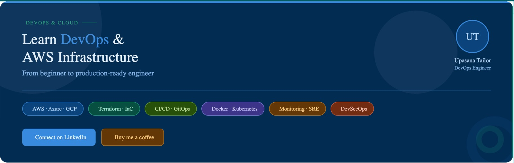
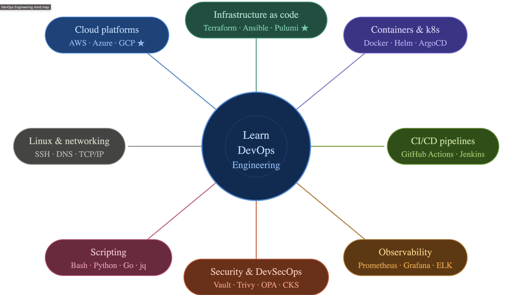

<div align="center">
  

  <h1>AWS Terraform Projects</h1>

  <p>Daily hands-on Terraform + AWS projects — from zero to certified, one day at a time.</p>

  <a href="https://github.com/upasanatailor/AWS_Terraform_Projects">
    
  </a>
  <a href="https://github.com/upasanatailor/AWS_Terraform_Projects">
    
  </a>
  <a href="https://github.com/upasanatailor/AWS_Terraform_Projects">
    
  </a>
  <a href="https://github.com/upasanatailor/AWS_Terraform_Projects">
    
  </a>
  <a href="https://github.com/upasanatailor/AWS_Terraform_Projects">
    
  </a>
  <a href="https://github.com/upasanatailor/AWS_Terraform_Projects">
    
  </a>
  <a href="https://github.com/upasanatailor/AWS_Terraform_Projects">
    
  </a>
</div>

---


## 🔧 What is Terraform?

[Terraform](https://www.terraform.io/) is an open-source Infrastructure as Code (IaC) tool by HashiCorp. It lets you define cloud infrastructure using a declarative configuration language (HCL — HashiCorp Configuration Language) and provision it consistently across multiple cloud providers, including AWS, Azure, and GCP.

The core Terraform workflow is simple:

> **Write** your infrastructure config → **Plan** the changes → **Apply** to provision real resources

<div align="center">
  
</div>

Key Terraform concepts used throughout this repo:

- **Providers** — plugins that interact with cloud APIs (e.g., the AWS provider)
- **Resources** — the infrastructure objects you manage (EC2 instances, VPCs, S3 buckets)
- **State** — Terraform's record of what it has provisioned, stored in `terraform.tfstate`
- **Modules** — reusable groups of resources for DRY infrastructure code
- **Variables & Locals** — parameterize and simplify your configurations

---


## ☁️ What is AWS?

[Amazon Web Services (AWS)](https://aws.amazon.com/) is the world's largest cloud computing platform, offering on-demand infrastructure services to individuals, startups, and enterprises. With AWS you pay only for what you use — no upfront hardware costs, no data center management.

Service categories used across the projects in this repo:

- **Compute** — EC2 instances for running virtual machines in the cloud
- **Networking** — VPC, Subnets, Route Tables, Internet Gateway for building isolated network environments
- **Storage** — S3 for object storage, EBS for block storage attached to EC2
- **Security** — IAM roles and policies, Security Groups for access control and least-privilege enforcement

---


## 📚 About This Repository

This repository is a structured, daily learning series where each `DayN_<Topic>/` folder contains one complete, hands-on Terraform + AWS project. Every project is self-contained — you can clone it, run it, and tear it down independently.

**What you'll learn:**

- **Terraform proficiency** — HCL syntax, state management, variables, validation, locals, and modules
- **AWS service knowledge** — VPC, EC2, S3, IAM, Security Groups, and more, built from scratch with Terraform
- **DevOps practices** — Infrastructure as Code (IaC), automation, version control, and repeatable deployments
- **Certification readiness** — Projects map directly to HashiCorp Terraform Associate and AWS Solutions Architect exam domains

Whether you're a beginner picking up Terraform for the first time or an experienced engineer preparing for a certification, this repo gives you real, deployable infrastructure to learn from.

---


## 📅 Daily Projects

| Day | Topic | Key Concepts | Folder |
|-----|-------|-------------|--------|
| Day 2 | VPC Networking | VPC, Subnets, Route Tables, Internet Gateway, EC2, Security Groups | [Day2_VPC_Networking](./Day2_VPC_Networking/) |
| Day 3 | Variables, Validation & Locals | Input variables, validation rules, local values, tfvars | [Day3_Variables-Validation_locals](./Day3_Variables-Validation_locals/) |

> 📝 **Contributors:** When adding a new `DayN_<Topic>/` folder, please update this table with the day number, topic, key concepts, and a link to the folder.

---


## 🚀 Getting Started

### Prerequisites

Before running any project, make sure you have the following installed and configured:

- **Terraform CLI** ≥ 1.0 — [Install Terraform](https://developer.hashicorp.com/terraform/install)
- **AWS CLI** v2 — [Install AWS CLI](https://docs.aws.amazon.com/cli/latest/userguide/install-cliv2.html)
- **AWS account** with credentials configured — run `aws configure` to set your Access Key, Secret Key, and default region

### Steps

1. **Fork the repository** — click the [Fork](https://github.com/upasanatailor/AWS_Terraform_Projects/fork) button on GitHub to create your own copy for personal use and experimentation.

2. **Clone your fork:**

```bash
git clone https://github.com/upasanatailor/AWS_Terraform_Projects
cd AWS_Terraform_Projects
```

3. **Navigate into a day folder:**

```bash
cd Day2_VPC_Networking
```

4. **Initialize Terraform** (downloads the AWS provider):

```bash
terraform init
```

5. **Preview the changes** Terraform will make:

```bash
terraform plan
```

6. **Apply the configuration** to provision real AWS resources:

```bash
terraform apply
```

7. **Destroy resources** when you're done to avoid AWS charges:

```bash
terraform destroy
```

> ⚠️ Always run `terraform destroy` after finishing a project to clean up AWS resources and avoid unexpected costs.

---


## 🎓 Certification Resources

The projects in this repo are designed to reinforce real exam topics — not just theory.

### HashiCorp Terraform Associate

The [HashiCorp Terraform Associate certification](https://developer.hashicorp.com/certifications/infrastructure-automation) validates your ability to use Terraform to provision, manage, and destroy infrastructure. Every project in this repo uses exam-relevant HCL patterns: variables, validation, locals, providers, resources, state, and outputs.

### AWS Certifications

- [AWS Solutions Architect – Associate](https://aws.amazon.com/certification/certified-solutions-architect-associate/) — covers VPC design, EC2, IAM, S3, and networking fundamentals, all of which are hands-on in this repo
- [AWS DevOps Engineer – Professional](https://aws.amazon.com/certification/certified-devops-engineer-professional/) — covers IaC, automation pipelines, and operational excellence, directly aligned with the Terraform + AWS workflow practiced here

Each day folder covers topics that appear in both the Terraform Associate and AWS exam domains, giving you practical, deployable experience alongside your study materials.

---


## 👩‍💻 About the Author

**Upasana Tailor** is a Cloud & DevOps practitioner, educator, and content creator passionate about making cloud infrastructure accessible to everyone. She creates hands-on Terraform and AWS content to help developers and engineers build real skills and pass certifications.

<div align="center">

  <a href="https://www.linkedin.com/in/upasana-tailor-b24539152/">
    
  </a>
  <a href="https://github.com/upasanatailor">
    
  </a>
  <a href="https://www.youtube.com/@CloudKaro">
    
  </a>

</div>

---


## 🌟 Support & Community

<div align="center">
  
</div>

If this repo helps you on your cloud journey, please ⭐ **star it**, 🍴 **fork it**, and share it with your network. Every star helps more learners discover this content.

Watch the full video series on [CloudKaro YouTube](https://www.youtube.com/@CloudKaro) for step-by-step walkthroughs of every project — from initial setup to `terraform apply`.

---


## 🤝 Contributing

Contributions are welcome! Here's how to add a new daily project:

1. [Fork the repository](https://github.com/upasanatailor/AWS_Terraform_Projects/fork) on GitHub
2. Clone your fork and create a new branch: `git checkout -b day4-s3-static-site`
3. Add a new `DayN_<Topic>/` folder following the existing naming convention
4. Include a `README.md` inside the new folder describing the project, resources created, and how to run it
5. Update the [Daily Projects](#-daily-projects) table in the root `README.md` with the new entry
6. Open a pull request with a clear description of what the project covers

This repository is licensed under the [MIT License](./LICENSE). You are free to use, modify, and distribute the content with attribution.

